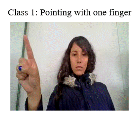
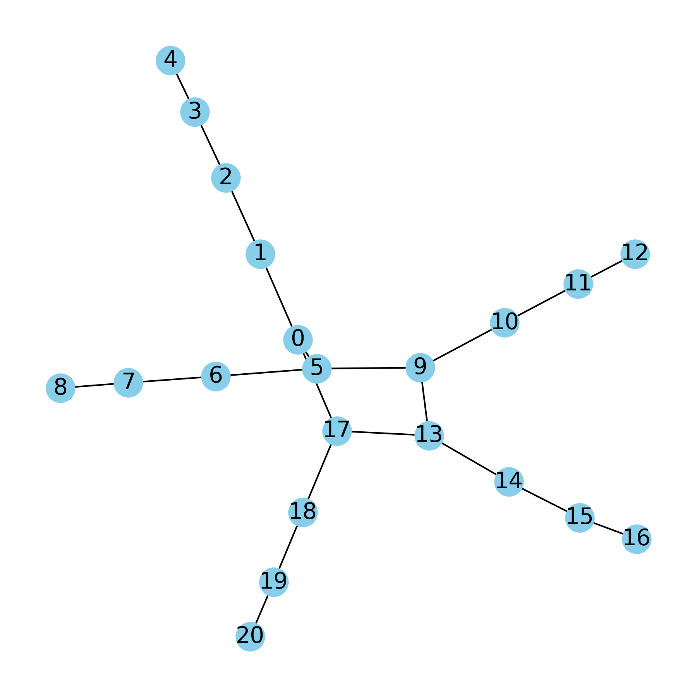

# Hand Gesture Classification 
**using Spatio-Temporal Graph Convolutional Network**

## Dataset: [IPN Hand Dataset](https://gibranbenitez.github.io/IPN_Hand/)
Contains videos of 13 static and dynamic gestures for interaction with touchless screens.
An introduction video of the dataset can be found [here](https://youtu.be/OH3n5rf2wV8). More details in our [ICPR2020 paper](https://gibranbenitez.github.io/2021_ICPR_IpnHand.pdf).
The data and annotations in the IPN Hand dataset are licensed under a Creative Commons Attribution 4.0 License.

### Example classes

## Hand Keypoints Graph

Using hand keypoints graph with 21 OpenCV hand landmarks.

The data was divided into 20-frame sequences, with window shift by 10 frames (10-frame overlap).

## Results
TBD

Test Accuracy: 

Test Loss (cross-entropy):

F1:

Precission:

Recall:

**Training and Test Graphs**
TBD

## Usage
### Quick Start
TBD 
Use [this google colab notebook]() for quick inference using pretrained model.

You can download prerained weights (classification of for three classes: Point, Click and Throw Up) from [this huggingface repo](https://huggingface.co/kmazrolina/HandGestureSTGCN).

### Train and evaluate

1. Run `setup.sh` script to create virtual environment, install requirements and download IPN Hand Dataset into `data/` and preprocess the data (extracting hand keypoints from video frames).

2. Train and test the model using `Train_STGCN.ipynb` notebook. You can use `run.slurm` script to run training as a slurm job.

3. Run `Infer_and_Eval.ipynb` for inference and evaluation.

## Resources
- Benitez-Garcia, Gibran, et al. "Ipn hand: A video dataset and benchmark for real-time continuous hand gesture recognition." 2020 25th international conference on pattern recognition (ICPR). IEEE, 2021.
- Yu, Bing, Haoteng Yin, and Zhanxing Zhu. "Spatio-temporal graph convolutional networks: A deep learning framework for traffic forecasting." [arXiv preprint arXiv:1709.04875 (2017)](https://arxiv.org/abs/1709.04875).

